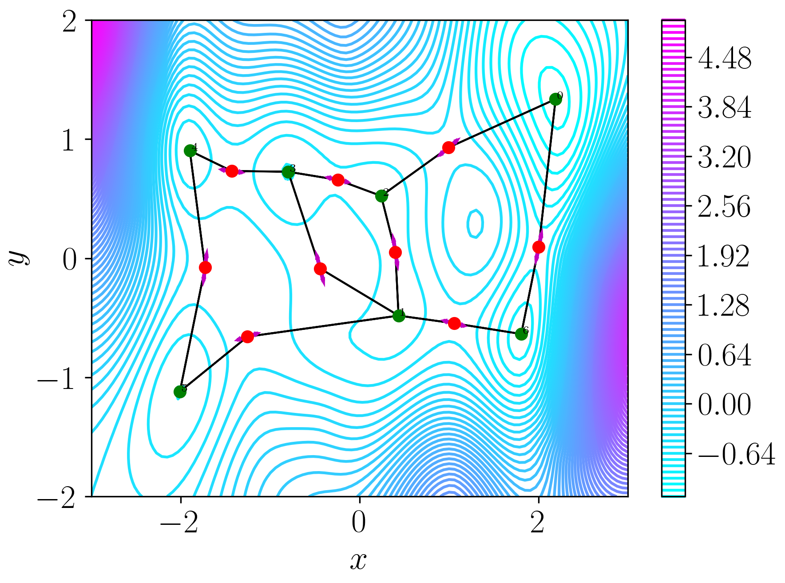
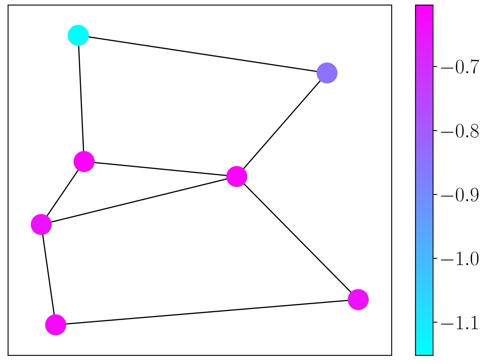

<p align="center">
    
</p>

# TopSearch

_This project is currently migrating to open source. Please check back regularly as more functionality is being added and updated_

## Introduction

The TopSearch package provides functionality to map the topography of surfaces, and can be used to map the solution space of machine learning algorithms. Many machine learning algorithms have non-convex loss (or cost) functions, and the aim of fitting is usually to locate low-valued or diverse solutions. An understanding of the solution space organisation provides key understanding about the reproducibility, explainability and performance of ML methods. 

The methodology derives from the field of chemical physics, and is agnostic to the given surface, allowing application to a wide range of machine learning algorithms. Leveraging ideas from chemical physics we can assess the performance and reliability of [neural networks](https://doi.org/10.1088/2632-2153/ac49a9), [Gaussian processes](https://arxiv.org/abs/2305.10748), Bayesian optimisation, [clustering algorithms](https://doi.org/10.1063/5.0078793) and understand the effect of [dataset roughness](https://doi.org/10.1039/D3ME00189J) on model performance. Application of the same framework to many different machine learning paradigms provides a route for transferable understanding, and its application to machine learning is reviewed in [this paper](https://doi.org/10.1039/D3DD00204G).

## Overview

The topographical mapping is performed using the [energy landscape framework](https://doi.org/10.1146/annurev-physchem-050317-021219). The energy landscape framework, developed in chemical physics, encodes surfaces as a network of stationary points. These stationary points, points with zero gradient, can be either local minima or transition states. Transition states are maximal in a single direction and local minimisation along that given direction (both forwards and backwards) locates two connected minima. Each transition state gives the lowest barrier between its two connected minima, and provides information about the intermediate behaviour of the function. In the network, each minimum is a node and edges exist between minima connected by a transition state. The complete network of minima and transition states constitutes the solution landscape, and we show an example landscape below.

|   |
|:--:|
| **Top**: A contour plot of the original surface with the stationary points, and their connections, overlaid. The minima are given in green, the transition states in red, and the connections between them with solid black lines. **Bottom**: The corresponding network abstraction of the surface. Here, the separation between connected nodes is specified by the height of the transition state between them. |

Topographical mapping of surfaces involves two main steps:
* Global optimisation &rarr; location of the global minimum and other low-valued local minima of the surface
* Landscape exploration &rarr; attempt transition state searches between pairs of minima to generate a fully connected set of minima

Global optimisation is usually performed using the [basin-hopping](https://arxiv.org/abs/cond-mat/9803344) algorithm within TopSearch. Basin-hopping is a modified Monte Carlo approach that includes local minimisation at each step to efficiently optimise complex solution spaces. During global optimisation we store all unique minima that we encounter, which gives us the initial set of minima that will be connected by transition state searches.

Landscape exploration involves selecting pairs of minima and attempting to find transition states between them. Transition state location is usually performed using a combination of double-ended and single-ended transition state searches. Double-ended searches aim to locate the lowest-valued path between a given pair of minima, and we use the [nudged elastic band algorithm](https://doi.org/10.1063/1.1329672) within TopSearch. Single-ended methods start from a single point and follow the lowest eigenmode towards the nearest transition state, and this is performed using [hybrid eigenvector-following](https://www-wales.ch.cam.ac.uk/pdf/CPL.341.185.2001.pdf). The nudged elastic band algorithm locates an approximate minimum energy path between two chosen minima, and the maxima on this path are refined to true transition states using hybrid eigenvector-following. There are a variety of schemes to decide which pairs of minima should be selected for transition state connections, all of which aim to produce a fully connected network of minima and explore important regions of solution space.

For more details of the methodology please refer to [`common_citations.md`](./common_citations.md).

## Installation

Instructions are for installation into a conda environment. First create the conda environment
```
conda create -n topsearch_env python=3.10
conda activate topsearch_env
```
The package is available on PyPI and can be installed using pip
```
pip install topsearch==0.0.1
```

For the source code you can clone the git repository locally using
```
git clone https://github.com/IBM/topography-searcher.git
```
and then install the dependencies using either
```
pip install -r requirements.txt
```
or from the pyproject.toml file with
```
poetry install
```

We can test the environment build by running
```
cd tests
pytest
```
For a successful build we should have all tests pass. If this is the case then enjoy using TopSearch!

_Note_: By default we do not specify the dependencies for molecular potentials (`dft.py`, `ml_potentials.py`) due to the large increase in environment size, which is unnecessary for machine learning applications. The dependencies for a given potential should be installed in addition if required. Therefore, we do not run the tests in `molecular_potentials` by default, but these can be run manually with
```
cd tests
cd molecular_potentials
pytest test*
```

## Examples

We provide several examples to illustrate the tasks that TopSearch can perform in [`examples`](./examples). These examples are provided as both an annotated Jupyter notebook or a python script (the scripts are further separated for ease), and each example has a detailed description of its content within the README. `example_function` as a [notebook](./examples/notebooks/example_function.ipynb) or [scripts](./examples/scripts/example_function) are the best place to start for an introduction to the methodology, where we apply it to some simple test functions.

## Contributors

This package is written and maintained by Luke Dicks at IBM Research as part of the AI-Enriched Simulation team. Please contact Luke (<luke.dicks@ibm.com>) or Edward Pyzer-Knapp (<EPyzerK3@uk.ibm.com>) for questions about how to use and/or contribute.

## License

TopSearch is an open-source software licensed under the MIT License. Check the details in the [`LICENSE`](./LICENSE) file.

## Citations

If you use this package please cite it appropriately using the 'Cite this repository' dropdown in the right sidebar. Moreover, we also provide a bibliography of previous relevant work in [`common_citations.md`](./common_citations.md). This file provides references to energy landscape algorithms and their applications to different fields of machine learning, each given as a bibtex entry with the handle providing a summary of the content.
